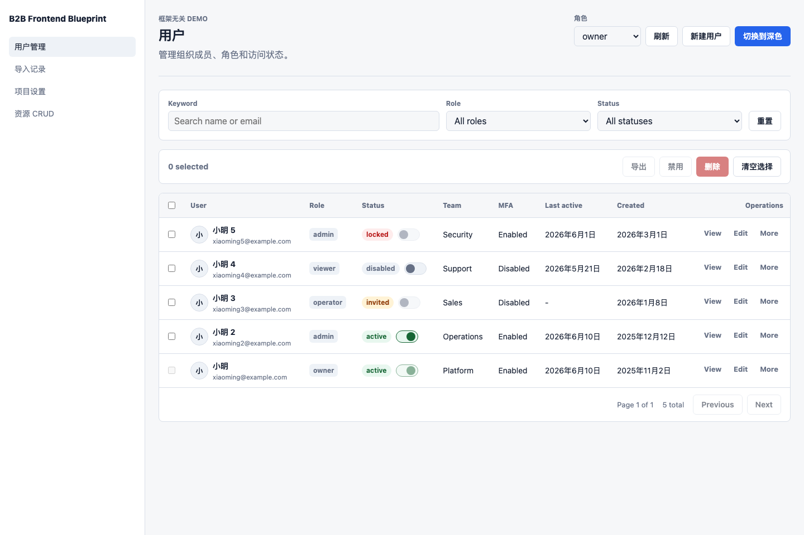

# B2B Frontend Blueprint

> AI-ready rules and a runnable starter for building practical B2B / enterprise console frontends.

B2B products are usually dense, permission-sensitive, workflow-driven, and heavily customized. Generic landing-page UI patterns do not translate well to tables, filters, dialogs, imports, detail pages, batch actions, and operational dashboards.

This repository turns those interaction decisions into reusable rules, docs, packages, demos, and a small framework-agnostic starter.



## What You Get

- **AI-ready interaction rules** for common B2B components and page patterns.
- **Human-readable docs** in English and Chinese.
- **Compact AI rule bundles** that can be loaded into coding agents.
- **A runnable vanilla demo** for list CRUD, import workflow, detail pages, dialogs, state views, theme, and i18n.
- **A local scaffold script** for generating a clean starter project.
- **Reusable packages** for request handling, runtime config, i18n, theme, resource modules, form schema, auth skeleton, and import workflow.
- **Resource module conventions** for building new CRUD pages with less repeated glue code.

## Current Status

This is an MVP blueprint, not a finished admin framework.

It is ready for:

- studying and reusing B2B interaction rules;
- asking AI to generate more consistent console UI;
- running the vanilla demo locally;
- generating a simple starter project;
- extending resource modules and API contracts.

It does not yet include:

- a published npm CLI;
- framework-specific React / Vue component libraries;
- a complete RBAC platform;
- a complete login/register/account system;
- a full E2E test suite.

## Quick Start

Install dependencies and run the demo:

```bash
pnpm install
pnpm dev
```

Open:

```text
http://127.0.0.1:4173/apps/demo-vanilla/
```

Do not open `apps/demo-vanilla/index.html` directly with `file://`. The demo uses ES modules and cross-package imports, so it needs the local dev server.

## Generate A Starter

Create a new framework-agnostic console project:

```bash
node scripts/create-blueprint.mjs my-console --template vanilla --with-demo
```

Create a cleaner starter without demo modules:

```bash
node scripts/create-blueprint.mjs my-console --template vanilla --without-demo
```

Generate a starter with runtime config:

```bash
node scripts/create-blueprint.mjs ops-console \
  --template vanilla \
  --modules users,imports,projects,activities \
  --app-name "Operations Console" \
  --locale zh \
  --theme system \
  --density compact \
  --api-base-url "https://api.example.com"
```

Then run the generated project:

```bash
cd my-console
pnpm build
pnpm dev
```

The generated app opens at:

```text
http://127.0.0.1:4173/apps/web/
```

## Scaffold Options

```text
--target <path>       Target directory. Overrides positional project name.
--template vanilla    Template name. Currently only vanilla is supported.
--with-demo           Include demo modules. Default.
--without-demo        Generate the app shell without demo modules.
--modules <list>      Comma-separated modules. Supported: users, imports, projects, activities.
--app-name <name>     App display name written to blueprint.config.js.
--locale <zh|en>      Default locale.
--theme <system|light|dark>
--density <comfortable|compact>
--api-base-url <url>  Backend API base URL.
--force               Overwrite target files.
--dry-run             Preview planned output without writing files.
```

Validate scaffold output:

```bash
pnpm test:scaffold
```

## Demo Coverage

The vanilla demo currently covers:

- **User Management**: filter bar, table, pagination, selection, batch actions, row detail, create/edit dialog, ConfirmDialog, disabled permission states, loading, empty, error, and request race handling.
- **Import Records**: upload workflow, stepper, field mapping, validation errors, failed-row download, result summary, recent import tasks, and partial failure state.
- **Project Detail**: detail page layout, edit mode, settings form, related members table, security switches, section-level forbidden/error states, danger zone, and activity log.
- **Generic Resource CRUD**: module registry, resource API contract, schema-driven forms, list/detail/edit/delete actions, refresh after save, and error handling.
- **Shared Runtime**: light/dark theme, Chinese/English i18n, density config, pending prevention, dangerous action confirmation, and section-level state handling.

## Use With AI

For AI-assisted page generation, start with:

- [All AI Rules Entry](./component-rules/_ai-bundles/all-ai-rules.md)
- [Core Foundation Bundle](./component-rules/_ai-bundles/core-foundation-ai-bundle.md)
- [List CRUD Bundle](./component-rules/_ai-bundles/list-crud-ai-bundle.md)
- [Form Overlay Bundle](./component-rules/_ai-bundles/form-overlay-ai-bundle.md)
- [Data Feedback Bundle](./component-rules/_ai-bundles/data-feedback-ai-bundle.md)
- [Import Workflow Bundle](./component-rules/_ai-bundles/import-workflow-ai-bundle.md)

Example prompt:

```text
Use the B2B Frontend Blueprint AI rules.
Build a resource management page with FilterBar, Table, pagination, row actions,
batch actions, create/edit dialog, ConfirmDialog for delete, loading/empty/error states,
and refresh after save. Follow the List CRUD and Form Overlay bundles.
```

## Documentation

Recommended entry points:

| Topic | English | Chinese |
| --- | --- | --- |
| Getting Started | [getting-started.md](./docs/getting-started.md) | [getting-started.zh.md](./docs/getting-started.zh.md) |
| MVP Scope | [mvp-scope.md](./docs/mvp-scope.md) | [mvp-scope.zh.md](./docs/mvp-scope.zh.md) |
| Add Resource Module | [add-resource-module.md](./docs/add-resource-module.md) | [add-resource-module.zh.md](./docs/add-resource-module.zh.md) |
| API Integration | [api-integration.md](./docs/api-integration.md) | [api-integration.zh.md](./docs/api-integration.zh.md) |
| Rule Authoring | [rule-authoring-guide.md](./docs/rule-authoring-guide.md) | [rule-authoring-guide.zh.md](./docs/rule-authoring-guide.zh.md) |
| Template Architecture | [template-architecture.md](./docs/template-architecture.md) | [template-architecture.zh.md](./docs/template-architecture.zh.md) |
| MVP Implementation Plan | [mvp-implementation-plan.md](./docs/mvp-implementation-plan.md) | [mvp-implementation-plan.zh.md](./docs/mvp-implementation-plan.zh.md) |

Rule entry points:

- [Component Rules README](./component-rules/README.md)
- [AI Rule Bundles](./component-rules/_ai-bundles/README.md)
- [Rules Inventory](./component-rules/_inventory/rules-inventory.md)
- [Component Architecture Rules](./system-rules/component-architecture/component-architecture-rules.md)

Page and prompt examples:

- [Prompt Examples](./examples/prompts/README.md)
- [Page Demo Blueprints](./examples/pages/README.md)

## Rule File Convention

Each component rule module uses four files:

```text
{module}-rules.md
{module}-rules.zh.md
{module}-ai-rules.md
{module}-ai-rules.zh.md
```

File meanings:

- `*-rules.md`: English human-readable detailed rules.
- `*-rules.zh.md`: Chinese human-readable detailed rules.
- `*-ai-rules.md`: English AI-executable compact rules.
- `*-ai-rules.zh.md`: Chinese AI-executable compact rules.

## Packages

The current MVP keeps the implementation small and framework-agnostic:

```text
packages/
├── auth/              Permission and auth skeleton.
├── data/              Demo data helpers.
├── dom/               Small DOM utilities.
├── form-schema/       Schema-driven form metadata.
├── headless/          Headless interaction logic.
├── i18n/              Runtime language controller.
├── import-workflow/   Import workflow contract.
├── recipes/           Reusable page composition helpers.
├── request/           API adapter and error normalization.
├── resource/          Resource module and CRUD conventions.
├── runtime-config/    Runtime project configuration.
└── theme/             Theme and density controller.
```

The goal is to keep the starter portable. Teams can later wrap the same concepts in React, Vue, Svelte, or another stack.

## Repository Layout

```text
.
├── apps/demo-vanilla/          Runnable framework-agnostic demo.
├── component-rules/            Human and AI component interaction rules.
├── docs/                       Product, architecture, and integration docs.
├── examples/                   Prompt examples and page blueprints.
├── packages/                   Reusable framework-agnostic packages.
├── scripts/                    Local scaffold and validation scripts.
├── system-rules/               Architecture-level rules.
├── templates/vanilla/          Starter template used by the scaffold script.
├── ROADMAP.md
├── LICENSE
└── README.md
```

## Development

Run the full build check:

```bash
pnpm build
```

Run scaffold validation:

```bash
pnpm test:scaffold
```

Run the local demo:

```bash
pnpm dev
```

## Roadmap

Near-term direction:

- publish a real CLI package;
- add framework adapters while keeping the headless core reusable;
- expand auth and RBAC rules into runnable modules;
- add browser compatibility and graceful degradation rules;
- add E2E coverage for generated projects;
- provide more resource module examples;
- continue refining AI bundles for real production prompts.

See [ROADMAP.md](./ROADMAP.md) for the broader plan.

## License

MIT
